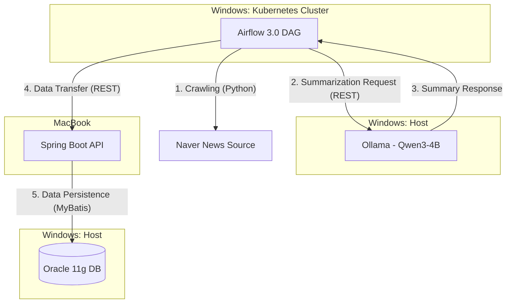

# 🏛️ Hybrid AI Pipeline & Home-Lab (MY-LAB)

<center>"Mac의 생산성"과 "데스크탑의 GPU 파워"를 결합한 하이브리드 MLOps 파이프라인 구축 프로젝트</center>


이 프로젝트는 ***Airflow 3.0***, ***Kubernetes***, ***Ollama***, Spring Boot를 활용하여 뉴스 데이터를 수집, 요약하고 저장하는 자동화된 데이터 파이프라인(Data Pipeline)입니다.

## 📖 Project Overview (프로젝트 개요)

로컬 개발 환경의 한계를 극복하기 위해 ***Client-Server*** 아키텍처를 물리적으로 분리하여 구성했습니다.
MacBook을 ***Control Plane***으로 사용하여 개발 및 관제를 수행하고, 고성능 GPU가 탑재된 Windows 데스크탑을 ***Worker Node***로 활용하여 AI 추론 및 컨테이너 오케스트레이션을 수행합니다.

## 🎯 Key Goals

Automated Pipeline: 뉴스 수집부터 AI 요약, DB 적재까지의 전 과정 자동화.

Hybrid Infrastructure: 서로 다른 OS(macOS, Windows/WSL2) 간의 네트워크 통신 및 리소스 통합.

Modern Tech Stack: Airflow 3.0, Spring Boot 3.4, Containerization 기술 활용.

On-Premise AI: 클라우드 비용 없이 로컬 GPU(RTX 5070)를 활용한 LLM(Large Language Model) 서비스 구축.

## 🏗 System Architecture (시스템 아키텍처)

### 1. Physical Architecture (물리적 구성)

```mermaid
graph LR
    subgraph Client_Zone [Client: Control & Management]
        direction TB
        Mac["M2 MacBook Air\nmacOS Sequoia\nControl Plane Node"]
    end

    subgraph Server_Zone [Server: Compute Resource]
        direction TB
        Win["Windows Desktop - WSL2\nGPU Worker Node\nAMD 7800X3D + RTX 5070 32GB"]
    end

    Mac <--- "Network (Wi-Fi / SSH Tunnel)" ---> Win
```
- Client (Control Plane): M2 MacBook Air

    - Role: Code Development, Kubernetes Cluster Management (kubectl, Helm), Spring Boot Backend Server.

- Server (Worker Node): Windows Desktop (AMD 7800X3D, RTX 5070, 32GB RAM)

    - Role: Hosting Kubernetes Cluster (Docker Desktop), AI Inference Engine (Ollama), Legacy Database (Oracle).

    - Networking: netsh Port Proxy를 통해 외부(Mac) 요청을 내부 컨테이너/앱으로 라우팅.

### 2. Logical Data Flow (데이터 흐름)



## 🛠️ Tech Stack (기술 스택)

| Category       | Technology                      | Description                                                       |
|----------------|----------------------------------|-------------------------------------------------------------------|
| Orchestration  | Apache Airflow 3.0.2             | Kubernetes 기반 워크플로우 관리. `@task.virtualenv` 를 활용한 격리된 실행 환경 구성 |
| AI / LLM       | Ollama                           | Local LLM 런타임. `qwen2.5:7b-instruct` 모델을 사용하여 뉴스 본문 요약 수행 |
| Backend        | Java 17, Spring Boot 3.4         | REST API 서버. Airflow로부터 데이터를 수신하여 비즈니스 로직 처리 |
| Persistence    | MyBatis, Oracle 11g              | 데이터 매핑 및 저장소. `MERGE INTO` 구문을 통한 데이터 멱등성 보장 |
| Infrastructure | Docker, Kubernetes (K8s)         | 컨테이너 런타임 및 오케스트레이션. Helm Chart를 이용한 배포 관리 |
| DevOps         | Shell Script, Git                | `sync_dags.sh` 를 통한 배포 자동화 및 버전 관리 |


## 📦 Service Pipeline Details

### 1. Data Collection (Crawler)

- Target: 네이버 뉴스 (IT/과학 섹션 랭킹).

- Tech: Python requests, BeautifulSoup4.

- Logic: 기사 목록을 파싱하고 각 기사의 상세 페이지에 접근하여 본문(content)을 추출.

### 2. AI Summarization (LLM)

- Engine: Ollama (Running on Windows GPU).

- Model: qwen3:4b

- Prompt Engineering: 뉴스 본문을 입력받아 핵심 내용을 3줄 요약으로 정제하도록 지시.

### 3. Backend & Storage

- API: Spring Boot RestController를 통해 JSON 데이터 수신.

- Data Integrity: Oracle MERGE INTO 쿼리를 사용하여 중복 뉴스 적재 방지(Idempotency) 및 데이터 무결성 확보.

## 🚀 How to Run (실행 방법)

### 1. Infrastructure Setup

- Windows: Start Docker Desktop & Ollama. Run netsh commands for port forwarding (6443, 11434, 1521).

- Mac: Run Spring Boot Application (NewsBackendApplication).

### 2. Deploy DAGs

Use the custom script to sync DAG files to Kubernetes pods.

``` bash
cd MY-LAB
./sync_dags.sh
```

### 3. Access Airflow UI

Airflow 3.0 architecture accesses the UI via the API Server.

```bash
./k8s/port-forward.sh
```


📂 Project Structure
```text
MY-LAB/
├── dags/                  # Airflow DAGs (Python)
│   └── 02_naver_news.py   # Main Pipeline Code
├── k8s/                   # Kubernetes & Helm Configs
│   ├── airflow-values.yaml
│   └── port-forward.sh
├── news-backend/          # Spring Boot Project (Java)
│   ├── src/main/java/.../controller  # API Endpoint
│   ├── src/main/java/.../service     # Business Logic
│   └── src/main/resources/mapper     # MyBatis XML
├── sync_dags.sh           # Deployment Script
└── README.md              # Project Documentation
```


## 🔧 Troubleshooting

본 프로젝트 구축 과정에서 발생한 네트워크(Port-Forwarding), Airflow 3.0 호환성, DB 연결 이슈 등에 대한 상세한 해결 과정은 별도 문서로 정리하였습니다.

👉 Troubleshooting Guide 보러가기